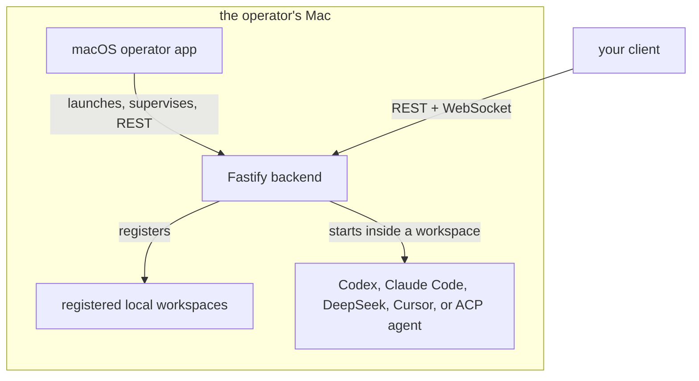

# AgentRoom server and macOS app

[](https://github.com/ethics-of-ai/agent-room-server/actions/workflows/ci.yml)

AgentRoom runs coding-agent sessions on a Mac and exposes them to clients over
REST and WebSocket. The backend registers local folders as workspaces, starts
Codex, Claude Code, DeepSeek Harness, Cursor, or an external ACP agent inside
them, owns session state, and streams typed events. The macOS app is the
operator console: it configures runners, keeps secrets in Keychain, registers
workspaces, starts and supervises the backend, and shows diagnostics.

This repository holds the backend, the macOS app, and the Swift client library
the Apple apps compile. It does not hold the visionOS app. That app is the main
session client (threads, editor, source control, spatial diagrams) and is not
open source yet. The Mac app's Threads view supervises sessions and can stop a
turn, but it does not send prompts. With this repository alone you run the
backend and drive turns through its API with `curl` or a client of your own;
[Local Mac server](docs/operations/LOCAL_MAC_SERVER.md) walks through that.



## What is here

| Path | Contents |
| --- | --- |
| `apps/backend` | Fastify API, workspace registry, sessions and turns, runner adapters, events, audit, file access, Git operations, terminal sessions, spatial document composition |
| `apps/macos` | SwiftUI operator app: backend supervision, runner setup, Keychain storage, workspace registration, managed settings, diagnostics |
| `apps/shared/AgentRoomClient` | Swift API contracts and REST client code compiled into the Apple apps |
| `scripts` | DMG packaging and local install |
| `docs` | Architecture, API, operations, trust posture, engineering records |

The backend supports persistent agent threads with live assistant text,
reasoning, tool activity, plans, diffs, token usage, and permission events;
explicit file and directory context, runner-native skill discovery, and PNG,
JPEG, or WebP turn attachments; bounded workspace browsing, quick open, literal
content search, and a single bounded UTF-8 file write; Git status, branches,
staging, discard, commit, fetch, fast-forward pull, push, and branch creation
through fixed operations; an optional terminal that opens a real shell on the
Mac (off by default); live SVG and Mermaid sketches; and composition of
`*.diagram.json` and `*.scene.json` spatial documents with their human override
layers.

## Download

Each release on the [Releases page](https://github.com/ethics-of-ai/agent-room-server/releases)
carries `AgentRoom-<version>-arm64.dmg`,
`AgentRoom-<version>-release.json`, and `SHA256SUMS.txt`. The manifest records
the backend/API compatibility policy used by AgentRoom clients. Both the DMG
and manifest are covered by the checksums. The app is signed with a Developer
ID certificate and notarized by Apple, so it opens like any other downloaded
Mac app. Apple Silicon only.

Verify the download before opening it:

```bash
shasum -a 256 -c SHA256SUMS.txt
```

Open the DMG, drag `AgentRoom.app` to Applications, and launch it. The app
bundles its own Node.js runtime and the compiled backend, so nothing else has to
be installed to start the backend. You still need at least one runner: Codex
(set its executable path in the app), Claude Code (sign in with `claude login`
as the Mac user), Cursor (run the sign-in command in
[Signing in to Cursor](docs/clients/MACOS.md#signing-in-to-cursor); a Cursor
Pro plan or better is required), or DeepSeek Harness (see the
[DeepSeek runner guide](docs/engineering/DEEPSEEK_HARNESS_RUNNER.md)).

## Build from source

Requirements:

- macOS 14 or later to run the app; Xcode 26 to build it.
- Node.js 24 LTS or newer and pnpm 9.15.4 (`npx pnpm` works without a global
  install).
- XcodeGen for the Mac project.

Backend:

```bash
pnpm install
cp .env.example .env
```

Set up a runner in `.env`. A direct Codex setup needs at least an absolute
executable path:

```dotenv
CODEX_EXECUTABLE=/absolute/path/to/codex
```

Claude Code uses the Mac user's existing `claude login`. Cursor's SDK is
bundled; `pnpm --filter @agentroom/backend cursor:login` completes the web
sign-in it reads. Create a bearer token before connecting another device:

```bash
npx pnpm --filter @agentroom/backend auth:init
```

Run in development (port 8787, debug page at `http://localhost:8787`, health
check at `/health`):

```bash
pnpm dev
```

Or compiled:

```bash
pnpm --filter @agentroom/backend build
pnpm --filter @agentroom/backend start
```

Mac app (build the backend first; development builds of the app find
`apps/backend/dist/index.js` in this checkout):

```bash
pnpm --filter @agentroom/backend build
cd apps/macos
xcodegen generate
open AgentRoomMac.xcodeproj
```

Run the `AgentRoomMac` scheme. The generated Xcode project is not source; edit
[`apps/macos/project.yml`](apps/macos/project.yml) and regenerate. See
[`apps/macos/README.md`](apps/macos/README.md) for what the app does and how it
locates the backend.

Local DMG:

```bash
npx pnpm dist:macos
```

This writes `build/distribution/macos/AgentRoom.app` and `AgentRoom.dmg`. The
script copies the Node runtime it finds on your machine unless
`AGENTROOM_NODE_RUNTIME_DIR` points at a full Node.js macOS distribution, and it
signs and notarizes only when `AGENTROOM_CODESIGN_IDENTITY` and the notary
variables in [`scripts/package-macos.mjs`](scripts/package-macos.mjs) are set.
`npx pnpm install:macos` replaces `/Applications/AgentRoom.app` with that build.

Before you change anything, make sure this passes:

```bash
pnpm typecheck
pnpm --filter @agentroom/backend build
pnpm test
```

## Configuration and trust

Startup values and secrets come from the environment or the Mac app's Keychain
storage: the bearer token, executable paths, bind address, storage locations.
Preferences and trust settings live in `$AGENTROOM_HOME/config/settings.json`;
the Mac app writes that file directly and clients edit it through
`GET`/`PATCH /api/config`. An environment value wins over the file and locks
that key, and managed changes apply after a backend restart. The annotated
[`.env.example`](.env.example) lists every setting; the
[API reference](docs/api/API.md) documents the managed settings response and
patch contract.

Registered does not mean sandboxed. Read these before pointing AgentRoom at a
repository you did not write:

- Codex loads the workspace's `AGENTS.md`, repository skills, and
  `.codex/config.toml`, including configured MCP servers and hooks.
- Claude Code can load the workspace's project settings, hooks, MCP servers,
  skills, and `CLAUDE.md`. Its default `bypassPermissions` mode is not confined
  to the registered folder.
- A DeepSeek turn is bounded by the operator-supplied Cordis composition, which
  AgentRoom cannot inspect.
- A Cursor turn is sandboxed by default, and that sandbox bounds writes (the
  workspace and `/private/tmp`) and network egress, not reads. It loads the
  workspace's `.cursor/hooks.json`, `.cursor/mcp.json`, rules, and skills
  unless `CURSOR_LOAD_WORKSPACE_SETTINGS` is off.
- The optional terminal is off by default. On, it is a real shell on the Mac,
  unsandboxed after launch.
- The backend binds to the LAN by default. Set `AUTH_TOKEN` before connecting a
  second device or enabling the terminal.

Workspace reads stay registered-folder-only, bounded, symlink-checked, and
secret-name filtered. The one client write is a bounded UTF-8 file endpoint with
an optimistic lock. Git routes accept fixed operations, not command strings. The
full posture, including known gaps, is
[Trust and safety](docs/safety/TRUST_AND_SAFETY.md).

## Ships with Claude Code and the Cursor SDK

The DMG bundles the Claude Agent SDK, which carries an unmodified Claude Code
binary. AgentRoom starts it as published by Anthropic, and each person signs in
with their own `claude login`; by default AgentRoom strips Anthropic credentials
from the child it spawns and intermediates no usage. Use of that binary is
governed by
[Anthropic's terms](https://code.claude.com/docs/en/legal-and-compliance).

The DMG also bundles the Cursor SDK and its Anysphere-signed helper binaries,
unmodified. Each person signs in with their own Cursor account through the
SDK's web login, on their own plan (Cursor Pro or better); AgentRoom holds no
Cursor credential and intermediates no usage. Use of the SDK is governed by
[Cursor's Terms of Service](https://cursor.com/terms-of-service).

Everything else the DMG bundles is listed in
[`THIRD_PARTY_NOTICES.md`](THIRD_PARTY_NOTICES.md).

## This repository is a mirror

Development happens in a private monorepo that also holds the visionOS app. A
workflow there publishes the paths in this repository after each change to its
`main`, as one commit per sync whose `Source-Commit:` trailer names the upstream
commit. Nobody pushes here by hand.

Issues are welcome. Pull requests are welcome as proposals: a maintainer reviews
them, ports the change upstream, and closes the PR with a pointer to the sync
commit it arrived in. See [`CONTRIBUTING.md`](CONTRIBUTING.md) for the details
and [`SECURITY.md`](SECURITY.md) for reporting vulnerabilities.

Some documents under `docs/` link to visionOS client documents that are not in
this repository. Those links point into the private tree.

## Documentation

Start with the [documentation index](docs/README.md), or go directly to:

- [Architecture](docs/architecture/ARCHITECTURE.md)
- [API](docs/api/API.md)
- [macOS client](docs/clients/MACOS.md)
- [Trust and safety](docs/safety/TRUST_AND_SAFETY.md)
- [Runner capability matrix](docs/engineering/RUNNER_CAPABILITY_MATRIX.md)

There is no separate agent guidance file in this tree; the documents above,
starting with [Trust and safety](docs/safety/TRUST_AND_SAFETY.md), are the
rules for anyone working here, person or agent.

## License

MIT. See [`LICENSE`](LICENSE).
