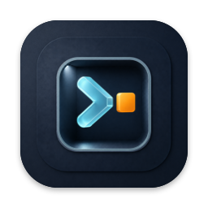
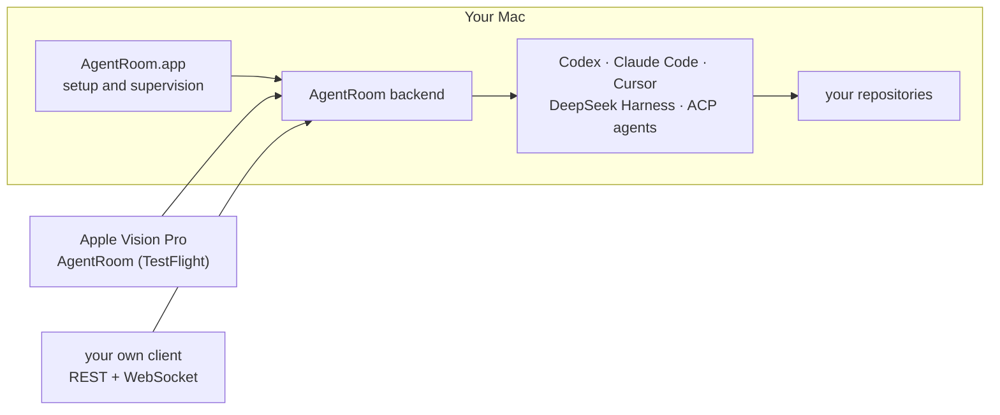

<p align="center">
  
</p>

<h1 align="center">AgentRoom</h1>

<p align="center">
  <strong>Spatial Agentic Engineering.</strong><br>
  Coding agents run in your repositories on your Mac. You direct them from Apple Vision Pro.
</p>

<p align="center">
  <a href="https://github.com/ethics-of-ai/agent-room-server/releases/latest"><strong>Download for Mac</strong></a>
  &nbsp;·&nbsp;
  <a href="https://testflight.apple.com/join/TVSxh8e2"><strong>Join the Vision Pro TestFlight</strong></a>
  &nbsp;·&nbsp;
  <a href="docs/README.md">Docs</a>
  &nbsp;·&nbsp;
  <a href="docs/safety/TRUST_AND_SAFETY.md">Security model</a>
</p>

<p align="center">
  <a href="https://github.com/ethics-of-ai/agent-room-server/actions/workflows/ci.yml"></a>
  <a href="https://github.com/ethics-of-ai/agent-room-server/releases/latest"></a>
  
  <a href="LICENSE"></a>
</p>

---

Agents already write code faster than one flat screen can review it. AgentRoom
gives each agent thread, diff, file, terminal, and diagram its own window, so
you can arrange your engineering work around you in Vision Pro while the agents
run on the Mac that holds your code and credentials.

This repository is the open-source half: the **backend** that runs the agents
and the **macOS app** that sets it up and keeps it running. The visionOS app is
in TestFlight.


```mermaid
flowchart LR
    vp["Apple Vision Pro<br/>AgentRoom (TestFlight)"]
    other["your own client<br/>REST + WebSocket"]

    subgraph mac["Your Mac"]
        app["AgentRoom.app<br/>setup and supervision"]
        backend["AgentRoom backend"]
        agents["Codex · Claude Code · Cursor<br/>DeepSeek Harness · ACP agents"]
        repos["your repositories"]
        app --> backend
        backend --> agents
        agents --> repos
    end

    vp --> backend
    other --> backend
```

## Features

**Agents**
- Codex, Claude Code, Cursor, DeepSeek Harness, and external agents that speak ACP, behind one API.
- Persistent threads that resume the agent's native conversation after a restart, crash, or update.
- Live assistant text, reasoning, tool calls, plans, diffs, token usage, and permission prompts.
- File, folder, and image context on any turn, plus each agent's own skills from the repository.

**Workspace**
- Browse, quick open, search, edit, rename, move, copy, and delete files in registered folders.
- Git status, staging, commit, branches, fetch, pull, and push through fixed operations.
- An optional terminal and optional editor language services (Swift, TypeScript, Python, Rust, Go, Java, Kotlin, C#). Both are off by default.

**Spatial** (Vision Pro app)
- Threads, editor, source control, and terminals as separate windows you can place around you.
- Live SVG and Mermaid sketches, and hand-drawn `.sketch.json` files saved in the repository.
- Architecture diagrams and scenes you can view and edit in a volume or an immersive space.

**Mac app**
- Starts and supervises the backend, with no Node.js install needed.
- Finds each agent's CLI, signs you in to Codex and Claude, and keeps keys in the Keychain.
- Registers workspaces, edits settings, and updates itself through Sparkle.

## Get started

**1. Install the Mac app.** Download `AgentRoom-<version>-arm64.dmg` from
[Releases](https://github.com/ethics-of-ai/agent-room-server/releases/latest),
check it, and drag `AgentRoom.app` to Applications. Releases are signed with a
Developer ID and notarized by Apple.

```bash
shasum -a 256 -c SHA256SUMS.txt
```

**2. Set up at least one agent** in AgentRoom's Settings.

| Agent | Setup |
| --- | --- |
| Codex | Found automatically, including the copy inside ChatGPT. Choose **Sign in to Codex**. |
| Claude Code | Bundled. Choose **Sign in to Claude**. |
| Cursor | Bundled. Sign in as described in [the Cursor guide](docs/engineering/CURSOR_SDK_RUNNER.md#credentials-and-billing). Needs Cursor Pro or better. |
| DeepSeek Harness | Point it at your runtime and composition. See [the DeepSeek guide](docs/engineering/DEEPSEEK_HARNESS_RUNNER.md). |

**3. Connect Vision Pro.** Install AgentRoom from
[TestFlight](https://testflight.apple.com/join/TVSxh8e2). On the Mac, open **Settings > Credentials**,
choose **Generate Token**, and save. In the Vision Pro app, enter your Mac's
address (for example `http://my-mac.local:8787`) and paste the token.

No headset? Drive the backend with `curl` or your own client. The
[local server guide](docs/operations/LOCAL_MAC_SERVER.md) and the
[API reference](docs/api/API.md) cover both.

## Build from source

You need Xcode 26, Node.js 24 or newer, pnpm 9.15.4 (`npx pnpm` works), and
XcodeGen.

```bash
pnpm install
cp .env.example .env        # set CODEX_EXECUTABLE or another runner
pnpm dev                    # backend on http://localhost:8787
```

The Mac app finds the backend built from this checkout:

```bash
pnpm --filter @agentroom/backend build
cd apps/macos && xcodegen generate && open AgentRoomMac.xcodeproj
```

`npx pnpm dist:macos` builds a local DMG. Run
`pnpm typecheck && pnpm --filter @agentroom/backend build && pnpm test` before
you open a pull request. [`.env.example`](.env.example) lists every setting, and
[`apps/macos/README.md`](apps/macos/README.md) covers the app.

## Security model

AgentRoom runs agents with your permissions on your Mac. A registered folder is
not a sandbox.

- Agents load the repository's own configuration: `AGENTS.md`, `CLAUDE.md`,
  skills, hooks, and MCP servers. Only register repositories you trust.
- Claude Code's default mode is not confined to the workspace. Cursor's sandbox
  limits writes and network access, not reads.
- File access stays inside registered folders, checks symlinks, and hides
  secret-named files. Git accepts fixed operations, never command strings.
- The backend listens on your network. Set an access token before you connect
  another device, the terminal, or language services.

Read [Trust and safety](docs/safety/TRUST_AND_SAFETY.md) for the full posture
and its known gaps. Report vulnerabilities through [`SECURITY.md`](SECURITY.md).

## Bundled agents

The DMG includes an unmodified Claude Code binary (through the Claude Agent
SDK) and the unmodified Cursor SDK. You sign in with your own account and plan;
AgentRoom holds no provider credentials and does not resell usage. Their use is
governed by [Anthropic's terms](https://code.claude.com/docs/en/legal-and-compliance)
and [Cursor's Terms of Service](https://cursor.com/terms-of-service). Other
bundled components are listed in [`THIRD_PARTY_NOTICES.md`](THIRD_PARTY_NOTICES.md).

## Contributing

This repository is a read-only mirror of a private monorepo that also holds the
visionOS app. Each sync is one commit whose `Source-Commit:` trailer names the
upstream commit.

Issues are welcome. Pull requests are welcome as proposals: a maintainer ports
the change upstream and links the sync commit it lands in. See
[`CONTRIBUTING.md`](CONTRIBUTING.md). Some documents link to visionOS sources
that are not published here.

## Documentation

- [Documentation index](docs/README.md)
- [Architecture](docs/architecture/ARCHITECTURE.md)
- [API reference](docs/api/API.md)
- [macOS app](docs/clients/MACOS.md), including [updates](docs/clients/MACOS.md#updates)
- [Runners](docs/engineering/RUNNERS.md)
- [Trust and safety](docs/safety/TRUST_AND_SAFETY.md)

## License

[MIT](LICENSE)
